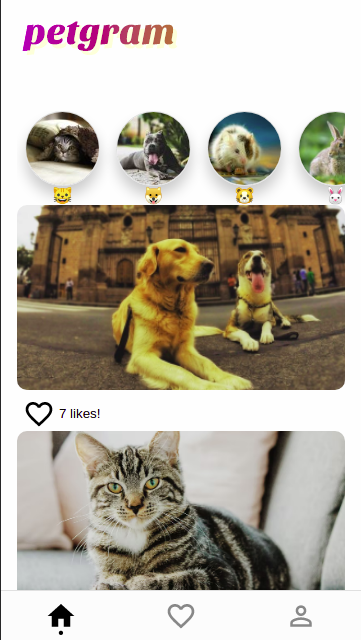

# Petgram

> An Instagram like PWA to see animals.

Create an account, explore and like pictures to check them later in your favorites.

## Built With

- Javascript
- React, Express, Cypress
- Apollo, GraphQL, Vercel

## Live Demo

[Live Demo Link](https://petgram-gabriel1590.vercel.app/)

## Getting Started

To get a local copy up and running follow these simple example steps.

### Prerequisites
Node v14.16.0

### Setup
`git clone https://github.com/Gabriel1590/petgram.git`.

`cd petgram`.

### Install
`npm install`

### Usage
Para correr en un ambiente de desarrollo: 
`npm run dev`

Para correr en un servidor:
`npm run serve`
### Run tests
`npm run test`

## Authors

👤 **Author**

- GitHub: [@Gabriel1590](https://github.com/Gabriel1590)
- LinkedIn: [LinkedIn](https://linkedin.com/in/linkedinhandle)

## Show your support

Give a ⭐️ if you like this project!

## Acknowledgments

- Made with the course of advance react of [@midudev](github.com/midudev), check to see some asome courses.

## 📝 License

This project is [MIT](./MIT.md) licensed.